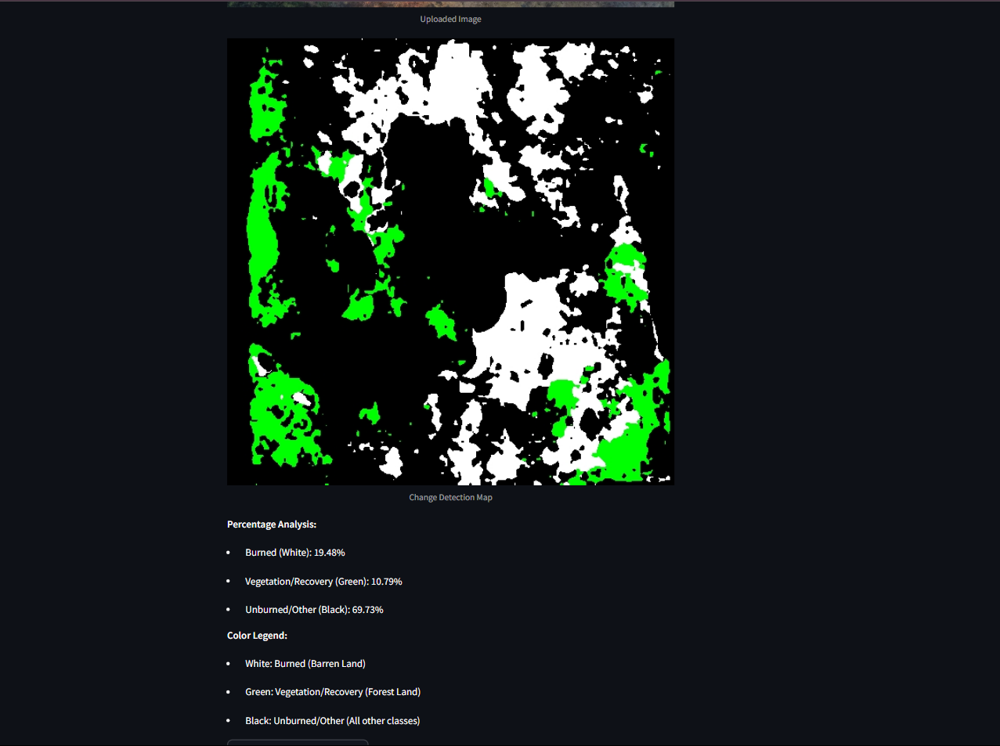

# SegFormer-Based Post-Wildfire Forest Change Detection Using MSSM-SCDNet 🌍🔥

This project presents an advanced deep learning solution for detecting forest changes after wildfires using **SegFormer-based architecture integrated with MSSM-SCDNet**. By leveraging **multi-temporal satellite imagery (Sentinel-2 and Landsat-8)** and **spatial-spectral attention mechanisms**, we aim to achieve high-precision semantic segmentation to identify **burned, unburned, and recovering forest areas**.

## 🚀 Key Features

- 🔍 **Automatic Change Detection** between pre- and post-wildfire images.
- 🛰️ **Multi-Temporal Satellite Input** (Sentinel-2 & Landsat-8).
- 🤖 Powered by **SegFormer Transformer Architecture**.
- 🧠 **MSSM-SCDNet** with spatial-spectral attention for better feature extraction.
- 📊 Achieves **82% Accuracy**, **77% F1-score**, and **70% Cohen’s Kappa**.
- 🌱 Supports **ecological restoration** and **disaster response**.
- 💻 **Streamlit Web UI** for uploading images and visualizing change maps in real-time.

## 🛰️ Sample Results

*Original satellite image of a wildfire-affected forest.*

*Output map showing: Burned (White), Vegetation Recovery (Green), Unburned/Others (Black).*

## 🛠️ Tech Stack

- Python 3.9+
- PyTorch with CUDA
- SegFormer Transformer
- MSSM-SCDNet
- Streamlit
- OpenCV, NumPy, Matplotlib
- Geospatial libs: Rasterio, GDAL

## 📁 Dataset

- [Sentinel-2](https://browser.dataspace.copernicus.eu/)
- [Landsat-8](https://earthexplorer.usgs.gov/)

Images include multispectral bands with key focus on:
- **NIR (Near-Infrared)**
- **SWIR (Short-Wave Infrared)**
- **Red Band**
